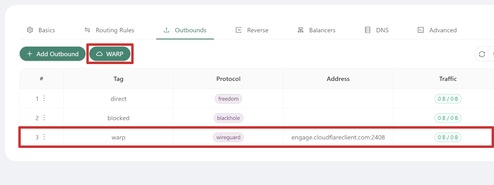
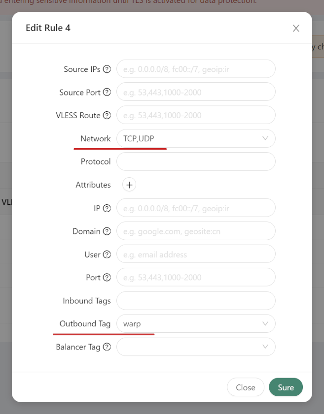
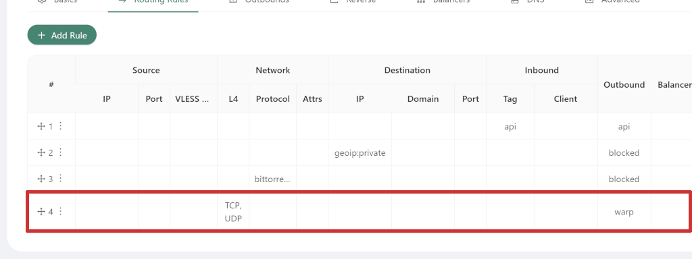

[⬅️ Назад](./)

# Как сделать Cloudflare WARP на своём VPN (на VPS с 3x-ui)?
На данный момент, **самый простой способ** разворачивать свой VPN на своём VPS сервере -- [это **3x-ui**](https://github.com/MHSanaei/3x-ui).

Он позволяет настроить **WARP** буквально **в два клика**.

Однако, сама настройка VPS и установка 3x-ui не тривиальна и является отдельной темой -- я не буду описывать весь процесс здесь.

[Вместо этого есть куча инструкций](https://www.youtube.com/results?search_query=3x-ui+%D0%BD%D0%B0%D1%81%D1%82%D1%80%D0%BE%D0%B9%D0%BA%D0%B0+warp).

Единственное замечание - в качестве скрипта для установки лучше использовать **оригинальный**:
```
bash <(curl -Ls https://raw.githubusercontent.com/mhsanaei/3x-ui/master/install.sh)
```
в инструкциях часто есть ссылки на другие установщики, не все из них **злонамеренные**, но некоторые -- да.
Лучше использовать оригинальный **3x-ui**, и **не** использовать сомнительные модификации без надобности.

### Так как же сделать WARP?:
- зайти в панель **3x-ui**
- зайти во вкладку **Xray Configs** слева
- зайти во вкладку **Outbounds**
- убедиться, что в списке есть строка с `Tag` = `warp`, `Address` = `engage.cloudflareclient.com:2408`
  <br>
  - если нет, создать её, нажав кнопку **☁️WARP** сверху списка
  - **обязательно** нажать **Save** сверху над вкладками, должно вылезти **The parameters have been changed.**
- зайти во вкладку **Routing Rules** и настроить правила под warp как угодно, проще всего:
  - добавить правило, нажав **Add Rule** сверху списка.
  - выставить `Outbound Tag` = `warp` -- это скажет правилу гонять трафик в наш Warp Outbound.
  - теперь нужно указать что именно мы хотим роутить в warp, для этого проще всего выставить какое-то поле, которое покроет весь трафиик, например `Source IPs` = `0.0.0.0/0` или `Network` = `TCP,UDP` -- это нужно, т.к. из-за пустых правил XRay выдаёт ошибку.
    <br>
  - подтвердить правило нажав **Add Rule** (или **Sure**)
  - **обязательно** нажать **Save** сверху над вкладками, должно вылезти **The parameters have been changed.**
- должно быть примерно так:
  <br>
- **обязательно** нажать **Restart Xray** сверху над вкладками, должно вылезти **Xray has been successfully relaunched.**

В результате, **ваш VPN будет гонять трафик через WARP и VRChat'у это должно понравиться**.

Если вы используете что-то другое вместо 3x-ui, то способ настройки аналогичный.

