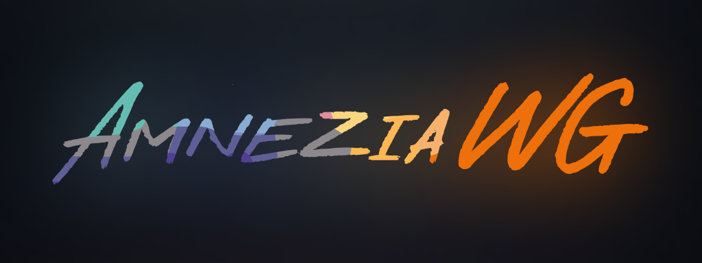
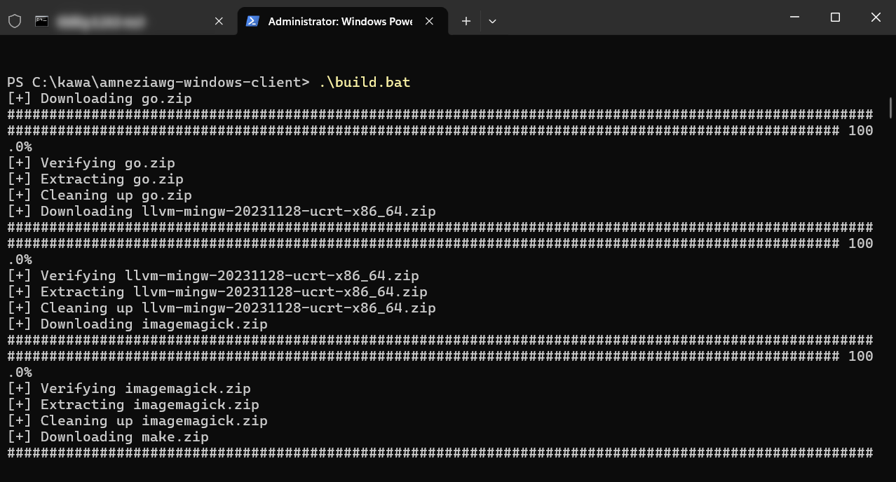
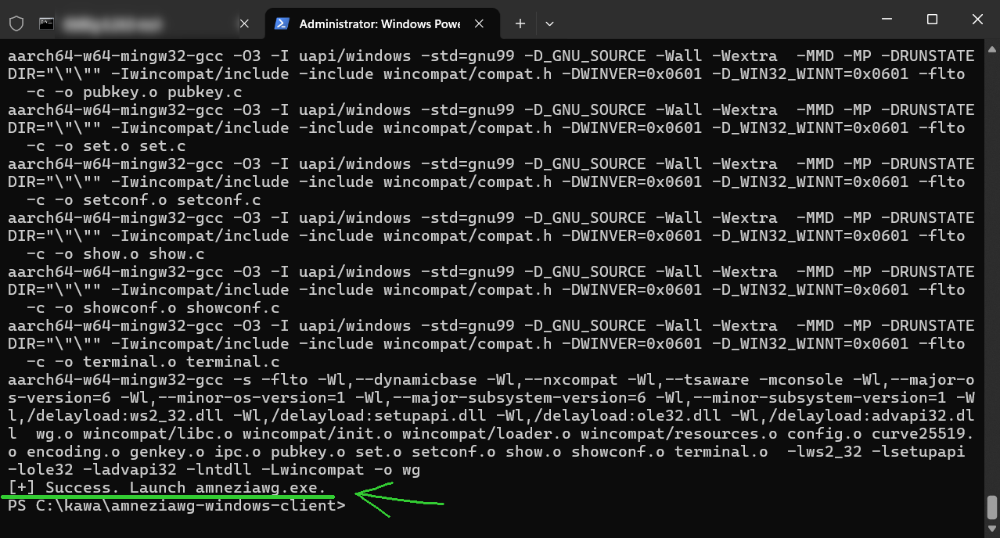

[⬅️ Назад](./)

# AmneziaWG 1.5 и 2
На момент написания этих страниц, уже созданы более **новые версии AmneziaWG** -
[`1.5`](https://github.com/amnezia-vpn/amneziawg-windows-client/commit/9b0947bab2c81b3f4c97cc69f43dfb4391ff6e9b)
и [`2.0`](https://github.com/amnezia-vpn/amneziawg-windows-client/commit/54fa022e2c40ed6d51f757e0871158372fb14977).

Новые версии существенно **лучше обходят блокировки**,
имеют [**дополнительные параметры** (`I1`, `I2` и т.д.)](https://docs.amnezia.org/documentation/amnezia-wg/#how-it-works),
а так же **разблокируют Cloudflare WARP в России**.

Но по каким-то причинам, на момент написания этих страниц, разработчики AmneziaWG **не** опубликовали бинарные файлы и установщики,
а на странице [Releases](https://github.com/amnezia-vpn/amneziawg-windows-client/releases)
лежит всё ещё **старая версия** [`1.0.2` от Мая 2025](https://github.com/amnezia-vpn/amneziawg-windows-client/releases/tag/1.0.2).

### По этому, нужно собрать их самим:
1. **Получить проект** у себя на компе с открытым терминалом:
    - Либо **вручную**:
        1. Зайти на [проект с github.com](https://github.com/amnezia-vpn/amneziawg-windows-client/)
        2. Нажать Code → Download ZIP
        3. Скачать и распаковать где-нибудь
        4. Зайти в папку, нажать по пустому месту правой кнопкой и нажать **"Открыть в Терминале"**
    
    - Либо через терминал **командами**:
        1. `git clone https://github.com/amnezia-vpn/amneziawg-windows-client.git`
        2. `cd amneziawg-windows-client`

2. **Запустить сборку** в этом терминале:
    1. Запускаем `.\build.bat`
    2. Должна начаться сборка.
         
       Сначала будет скачиваться среда `go`, `mingw` и прочие зависимости, а затем будет компиляция. Это займёт некоторое время.
    3. В результате должно написать `[+] Success. Launch amneziawg.exe.`
         
       и должны появиться новые папки: `x86`, `arm64` и `amd64`.
       В них лежат готовые к использованию сборки AmneziaWG.

Если это выглядят для вас слишком сложно или возникли какие-то проблемы,
то можете **скачать готовые файлы у тех, кому доверяете**.
Я пока публиковать ничего не буду.

Также, у вручную собранной версии может некорректно отображаться номер версии (например, `1.0.2`),
а в заголовке будет сказано "unsigned build, no updates" -- **это нормально**.

### Если у вас уже установлена (старая) AmneziaWG на ПК
То проще просто **закинуть новые файлы поверх старых**.
Этот способ позволяет AmneziaWG сразу "подсосаться" к вашим уже существующим конфигам и **продолжить рабоать бесшовно**.

1. Отключаем все VPNы, **закрываем** их, даже из системного трея возле часов, особено AmneziaWG.
2. Заходим в `C:\Program Files\AmneziaWG\` (ну или где там у вас она установлена)
3. Перекидывем туда из `amd64` все файлы (`amneziawg.exe`, `awg.exe` и `wintun.dll`) -- для этого **нужны права администратора**.
4. Запускам `amneziawg.exe` -- всё должно работать.

