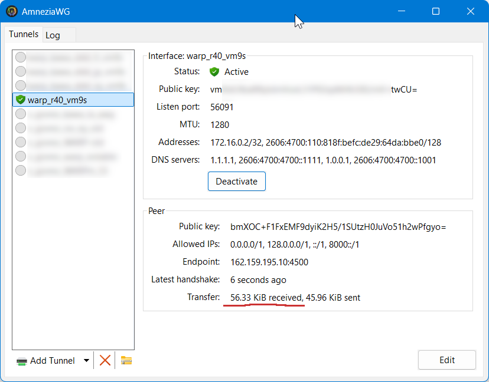
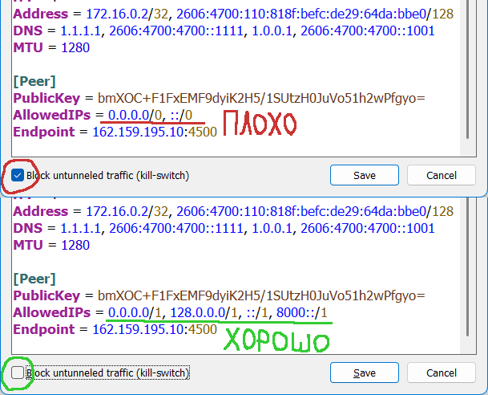

[⬅️ Назад](./)

# Как использовать AmneziaWG + Cloudflare WARP?
**Да! На данный момент, это не плохое решение.**
В чём суть: **WARP** под капотом использует **WireGuard**. Он заблокирован.
Но у WireGuard есть форк (модификация) - **AmneziaWG** (он же AWG, не путать с Amnezia). Он (пока что) хорошо обходит блокировки.
И к WARP **можно** подключаться через **AmneziaWG**. Этот способ не всегда и не у всех работатет. (Опять же - специфика DPI на ТСПУ в зависимости от времени, места, провайдера и т.п.)
Но если работает, то как правило **стабильно и без проблем**.
Обычно блокируются эндпоинты Cloudflare WARP по IP, т.е. если найти подходящий не забаненный IP, то будет работать.

## Что нужно для AmneziaWG + Cloudflare WARP на Windows?
1. [**Скачать и установить AmneziaWG**](https://github.com/amnezia-vpn/amneziawg-windows-client/releases) (не AmneziaVPN) (скачиваем `amneziawg-amd64-ци.фер.ки.msi`)
2. **Сгенерировать конфиг WARP для AmneziaWG.** Для этого есть разные сервисы в сети, например:
  - 👉🏻 [warp.llimonix.dev](https://warp.llimonix.dev/)
  - 👉🏻 [config-generator-warp.vercel.app](https://config-generator-warp.vercel.app/)
3. **Импоровать конфиг** (жмякнуть Add Tunnel и выбрать файл полученый на сайтах-генераторах)
4. Выбрать туннель из списка и жмякнуть **Activate**. **Важно:** То, что появилась зеленая иконка - **не** значит, что всё работает. Нужно смотреть на поле "Transfer:" внизу, см. 👇🏻 картинку.



Если **циферки `received` перебежали за пару десятков KiB** и продолжают расти, значит всё хорошо. Если **нет**, значит, скорее всего, DPI на ТСПУ определил AWG и **начал блокировать трафик**.

Вы также можете изучить **другие туториалы**, например:
- [www.notion.so/help-guide/WARP-1f72684dab0d80d5a475eef3a518c2c1](https://www.notion.so/help-guide/WARP-1f72684dab0d80d5a475eef3a518c2c1)

## Что нужно для AmneziaWG + Cloudflare WARP на Android и на шлемах (Quest / Pico)?
Нужно просто установить `.apk` AmneziaWG, а в целом всё тоже самое, что и на Windows.
[Скачать AmneziaWG для Android можно тут](https://github.com/amnezia-vpn/amneziawg-android/releases) (файл `AmneziaWG.apk`).
Вопрос как именно установить `.apk` на телфеоне или шлеме я оставлю за скобками.

На Quest этот способ также чинит неработающие сервисы Meta.

## Что делать если AmneziaWG + Cloudflare WARP не работает?
Вариантов не много:
1. Сгенерировать новый конфиг с другими опциями. Генерировать новый с теми же опциями вряд ли поможет.
2. Поменять Endpoint на другой.
В конфигах часто предлагают `162.159.192.1`, но он часто забанен.
Увеличивая третье и/или четвёртое число в IP по чуть-чуть, можно найти рабочий IP, например `162.159.195.10`.
Тоже самое с портами, их несколько.
[Полный список эндпоинтов Cloudflare WARP](https://www.notion.so/help-guide/WARP-1f82684dab0d8024a1c8fec230f5e4e1).


3. Поменять настройки обфускации Amnezia. Внутри конфига есть опции-циферки, их можно немного менять, что бы добиться работосопособности.
Например, у меня работает:
```
Jc = 4
Jmin = 40
Jmax = 1050
H1 = 1
H2 = 2
H3 = 3
H4 = 4
```
4. Использовать Cloudflare WARP через VPN:
- [Как сделать Cloudflare WARP на своём VPN (на VPS с 3x-ui)](./3x-ui.md)
- [Как пробросить Cloudflare WARP через любой XRay VPN (WARP-over-VLESS)](./warp-over-xray.md)


## При использовании AmneziaWG не работает локальная сеть / Virtual Desktop / Steam Link / другой стриминг по Wi-Fi. Что делать?
По-умолчанию все конфиги для AmneziaWG генерируются в режиме **kill-switch**, т.е. они пытаются перенаправить в себя **весь** трафик, в т.ч. и локальный. 
Для этого просто нужно изменить (кнопка Edit) настройки туннеля, поменяв `AllowedIPs` в разделе `[Peer]` с `0.0.0.0/0, ::/0` на `0.0.0.0/1, 128.0.0.0/1, ::/1, 8000::/1` или просто убрать галочку "**Block untunneled traffic (kill-switch)**" внизу.



Трюк заключается в том, что дробные правила AllowedIPs в таблицах маршрутизации имеют приоритет ниже, чем правила для локальной сети.

**Этот метод работает и для Android-устройств.**
