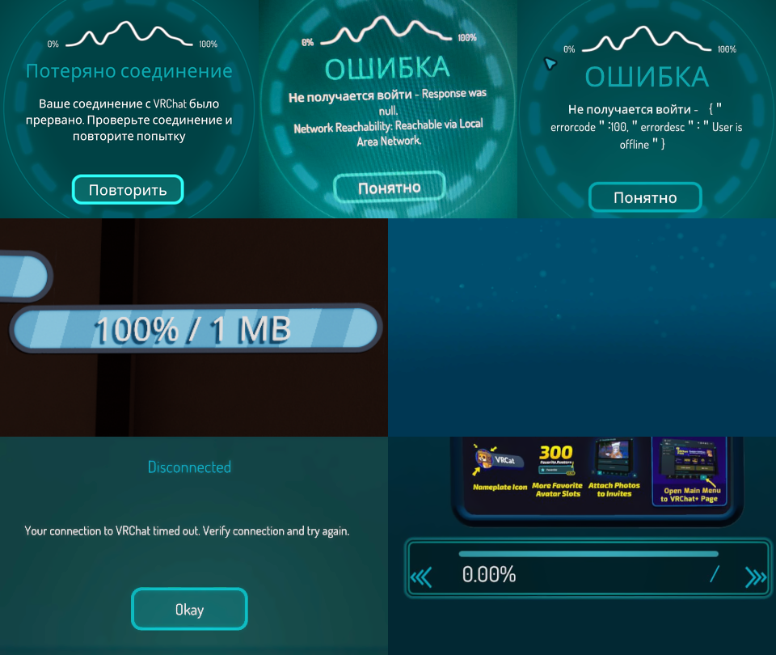
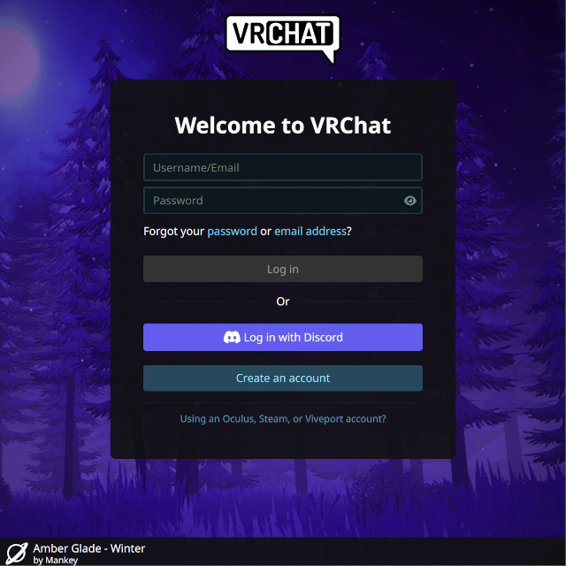
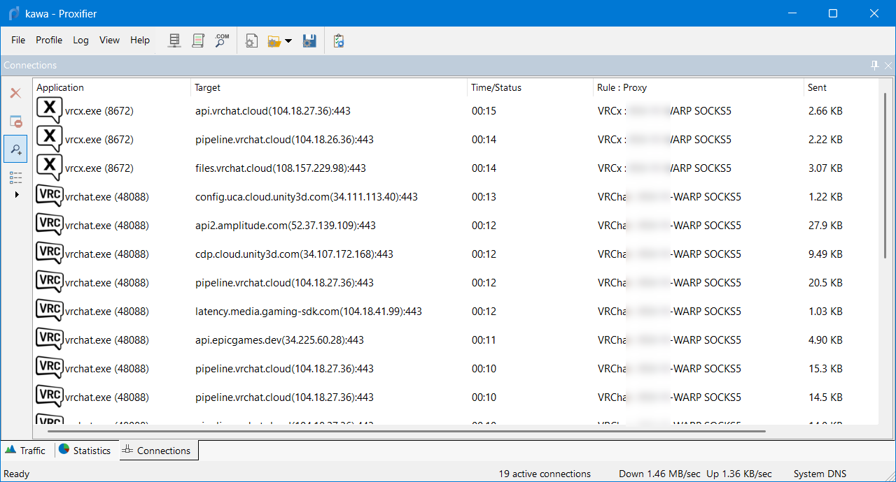
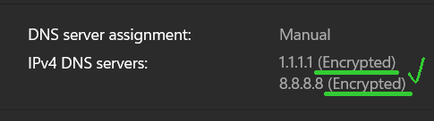

# Общая информация по (раз)блокировке VRChat
Эта страница -- сборная солянка информации о том, как заходить в VRChat в эпоху ограниченного интернета, и как преодолеть связанные с этим проблемы.
Основное обсуждение на [сервере VRChatRU в Discord](https://vrcru.org/discord) в [соответствующей ветке](https://discord.com/channels/666306330230915093/1306550460777234452).

### Под-страницы
(помимо стен текста ниже)
- [Как использовать AmneziaWG + Cloudflare WARP](./amneziawg-warp.md)
- [Как сделать Cloudflare WARP на своём VPN (на VPS с 3x-ui)](./3x-ui.md)
- [Как пробросить Cloudflare WARP через любой XRay VPN (WARP-over-VLESS)](./warp-over-xray.md)
- [Домена и IP VRChat](./domains-and-ips.md)

# Ситуация на данный момент
Формально, VRChat **не** заблокирован в РФ.
Фактически, у VRChat очень мало своей инфраструктуры, он опирается **на множество сторонних сервисов:**
- **Amazon AWS** -- хранение файлов ассетов (миров, аватаров, картинок).
- **Cloudflare** -- защита эндпоинтов API, веб-сервисы, сайт.
- **Photon Unity Networking** -- подключение к инстансам миров и обмен данными в них.
- и т.п.

А уже эти сервисы регулярно блокируются в РФ по тем или иным причинам. 
Это проявляется тем, что в VRChat в зависимости от времени, места, провайдера и т.п. случайным образом перестают разные компоненты:
- не грузятся файлы ассетов (миров, аватаров, картинок)
- перестаёт подключать к инстансам миров
- перестаёт работать Social (Контакты) и прочие меню
- перестаёт работать авторизация (залогинивание)
- выскакивают различные ошибки соединения, таймауты
- банально при входе в игру появляется сине-зелёный экран с пузырьками без чего либо

### Вот они, наши всадники апокалипсиса, которые мы уже знаем в лицо:

Кстати, **пожаловаться на ошибки** в России можно [на **отдельной странице** на форуме VRChat для обратной связи](https://feedback.vrchat.com/bug-reports/p/general-connection-problems-in-russia). Чем больше голосов, тем лучше.

# И что же делать?
**Краткий ответ:**
- либо добротный **VPN**,
- либо средства борьбы против DPI, например, **zapret**.

Но если бы всё было бы так просто...

## Почему zapret не помогает?
- Во-первых, все средства борьбы против DPI очень своеобразны. В зависимости от **времени, места, провайдера** и т.п. DPI на **ТСПУ работает по-разному** и такой обход может как работать, так и **не** работать. Это **не самый надёжный** и **не самый универсальный** метод на данный момент.
- Во-вторых, популярные конфиги для zapret'ов в сети ориентируются и тестируются на крупных и популярных ресурсах, вроде YouTube и Discord. Они **не** тестируются на VRChat и зачастую **не** работают с ним должным образом.
- В-третьих, иногда античиту EAC **не** нравится, когда zapret работает как служба (service)... а иногда ему всё равно, не ясно от чего это зависит. Если просто запускать zapret, то обычно проблем с античитом нет.
- В-четвёртых, конфиги zapret обычно фокусируются на HTTPS (TCP) траффике, а VRChat также использует UDP на адресах, которые иногда попадают под блокировки. Ещё, некоторые кривые конфиги пытаясь заблокировать QUIC блокируют UDP целиком.

Однако, существуют конфиги/сборки **zapret под VRChat**:
- Во-первых, [**zapret от kotrik**](https://kotrik.ru/zapret). Если вы предпочитаете zapret больше чем VPN, попробуйте сперва этот метод.
- Во-вторых, есть и другие потуги наших любителей поковыряться в конфигах, спрашивать в ветке в Discord, упомянутой в начале. 

## Почему VPN не помогает?
Это особенность VRChat, он фактически запрещает использовать VPN из-за самозащиты от ботов.
VRChat **не** раздаёт баны на аккаунты за VPN, но раздаёт **баны на IP-адреса**, а зачастую **на целые подсети**.
Даже свой VPN на VPS не всегда может помочь -- VRChat в принципе часто банит non-ISP/"не-домашние" сети.
Подразумевается, что пользователи должны заходить только из своих домашних сетей.
На эту политику VRChat уже давно жалуются не только в РФ, но и западных сообществах.

### Официальная позиция VRChat по этому вопросу:
**Не нужно использовать VPN**, но если очень хочется используйте **Cloudflare WARP**.

Да, VRChat оставили нам лазейку:

**Единственный легитимный** (и на практике -- **самый надёжный и универсальный**) способ подключения к **VRChat через VPN** -- это **Cloudflare WARP**.

# Но ведь Cloudflare WARP заблокирован?
**Да!** Но есть решения, см. ниже.

## Можно ли использовать zapret на обычном Cloudflare WARP?
Это **плохое решение**. По опыту, оно скорее **не**работает, чем работает, но никто не запрещает попробовать, у некоторых это работает.

Общее правило такое: используете zapret для регистрации в WARP и при включении и выключении.
Во время работы WARP можно отключить zapret.

Тут всё больше зависит от самого zapret и его конфига, чем от приложения Cloudflare WARP.

## Как использовать AmneziaWG + Cloudflare WARP?
**Да! На данный момент, это не плохое решение.**

[Этому способу посвящена **отдельная страница**.](./amneziawg-warp.md)

## Можно ли использовать Cloudflare WARP через VPN?
**Да!** И это решение даже стабильнее, чем zapret или AWG+WARP (если оно не очень работает).

Суть в том, чтобы подключаться к WARP **не** на напрямую (что могут заблокировать), а вместо этого:
- либо сделать так, чтобы **VPN-клиент WARP работал на сервере**, а вы через ваш локально работающий VPN-клиент подключались к вашему серверу, а он уже перенаправлял весь трафик в туннель WARP.
[Этот способ **типичный и отработанный**, на **этой странице** описано как сделать **Cloudflare WARP на своём VPN (на VPS с 3x-ui)**.](./3x-ui.md)
- либо сделать так, чтобы **локально работающий VPN-клиент WARP** подключался к серверам Cloudflare **через другой локально работающий VPN-клиент**.
[Этот способ **не обычный**, под него я тоже сделал **отдельную страницу**.](./warp-over-xray.md)

Оба способа **рабочие** и вполне **надёжные**, но требуют настройки и умений администрирования VPS.

# Как выбрать добротный VPN/VPS?
Тут варианта два:
- либо покупать **готовые услуги VPN у некого стороннего сервиса**,
- либо покупать **свой VPS-сервер** и запускать на нём **свой VPN**.

В обоих случаях, при покупке или создании своего VPN, нужно смотреть на **поддерживаемые протоколы**, сейчас:
- **не** блокируются, либо блокируются с большим трудом: **AmneziaWG**, **VLESS**, **Hysteria2** -- на эти протоколы следует смотреть **в первую очередь**.
- определяются и **блокируются очень легко**: OpenVPN, L2TP, WireGuard, Shadowsocks, VMESS, ... -- короче говоря, все остальные.
- не понятно: Trojan, Cloak -- были сообщения и о том, что работает, и о том, что не работает

Ещё, в случае VRChat, нужно смотреть, чтобы VPN/VPS **не были в чёрных списках VRChat**.
Заранее узнать это точно -- невозможно, поэтому тут только советоваться с людьми, которые **уже используют VPN в VRChat**.

[Есть публичный список провайдеров, которые **числятся "грязными"**](https://www.spamhaus.org/drop/asndrop.json) -- покупать их **НЕ надо**.
Если **сторонний VPN**, который вы купили, выдаёт IP из этого списка -- лучше **потребовать возврат средств**.

Также, [тут можно найти список VPS хостингов, принимающих **оплату криптой**](https://bitcoin-vps.com/#VPS-providers). 

# Запускаю VRChat или открываю сайт и у меня опять просит логин и пароль, почему?

У VRChat, по мимо описанных выше загонов с VPN, также наблюдается другой загон по безопасности: вам **нельзя часто менять локацию и/или IP адреса не из одной подсети**.

Причём это касается как **сайта**, так и самого **приложения** VRChat, так и **Unity VRC SDK**, так и **побочных приложений** типа **VRCX**.

Поэтому, вам следует использовать "постоянные" VPN, т.е. те, которые всегда обеспечивают вам **одну локацию** и **IP из одной и той же подсети**.
(К таковым относится и **Cloudflare WARP**.)
Вы **всегда** должны пользоваться тем, что хоть как-либо соприкасается с VRChat, только с **одного и того же VPN** и только с **одной и той же локации**.
Вы **не** должны менять VPN "как перчатки" и **не** должны пробовать использовать VRChat без VPN, иначе ваши сессии продолжат сбрасываться.

В этом смысле, постоянно работающий на всю систему VPN подходящий для VRChat -- является наиболее простым и универсальным решением, хоть и не очень удобным.

# Можно ли использовать проксификаторы на VRChat?
**С осторожностью.** Средства вроде [**Proxifier**](https://rutracker.org/forum/tracker.php?nm=Proxifier) или [**ProxiFyre**](https://github.com/wiresock/proxifyre) работают с VRChat, а античит EAC **не** жалуется.

Но загвоздка заключается в том, что **VRChat использует UDP** для общения с некоторыми серверами, а в проксификаторах **UDP это** традиционно **проблема**.
Например, Proxifier **не** поддерживает UDP вообще. ProxiFyre поддерживает UDP, но с ним наблюдались **проблемы**.
Также, не забывайте, UDP может не поддерживаться и со стороны SOCKS5-сервера к которому вы заворачиваете трафик.

Ещё важно, чтобы всё было **проксифицировано одинаково**,
т.е. **не** стоит делать трюки с проксификацией разных доменов в разные Proxy/VPN,
из-за особенностей VRChat описанных выше:
для корректной работы должна быть **одна локация и одна подсеть**.
И это касается **всех доменов**, например,
если забыть завернуть траффик сервисов Epic Games,
то античит EAC может начать сбоить.
Поэтому лучше заворачивать **процессы** VRChat целиком и вместе.

Но если таки хочется шаманить с доменами, то см. [Домена и IP VRChat](./domains-and-ips.md)

Если у вас **нет** блокировки UDP со стороны DPI ТСПУ
(т.е. без проблем заходит в инстансы без VPN, а проблемы только со скачиванием),
то можно использовать проксификаторы для заворачивания VRChat в SOCKS5-инбаунд XRay,
например, через в v2rayN или Nekobox в режиме "Do not change system proxy" и "Enable Tun = Off".
Проблем с разным путём для UDP и TCP (пока) не наблюдалось,
правило "одна локация и одна подсеть" по (всей видимости) (пока) не действует на Photon.

В общем, проксификация полезна, например, если **не хочется заворачивать в VPN всю систему** целиком.

# Поможет ли смена DNS на какой-то другой?
**Нет, крайне маловероятно.**
Вы, конечно, можете использовать
[`8.8.8.8`](https://ru.wikipedia.org/wiki/Google_Public_DNS),
[`1.1.1.1`](https://ru.wikipedia.org/wiki/1.1.1.1),
или ещё что-то,
но последние лет 10 блокировки опираются именно на фильтрацию пакетов трафика, а не на доменные имена.
(Если вы получили этот совет от какого-то Западника, то передайте ему, что это уже давным-давно не решение для Азии и Восточной Европы.)

### Тут в целом два совета:
- В идеале лучше вообще **отказаться от традиционного DNS** и перейти на [**DNS over HTTPS** (DoH)](https://ru.wikipedia.org/wiki/DNS_over_HTTPS).
DoH вряд ли повлияет на блокировки, но **спрячет** от глаз провайдера и ТСПУ на какие именно **сайты вы ходите** и какими именно **программами пользуетесь**.
- **Не** использовать DoH-сервисы из России, например Yandex DNS.
Да, местные DoH быстрее и вроде даже не фильтруют домена по спискам блокировок,
но они и **под контролем государства** -- не понятно, чего от них ждать в будущем.

### Настроить DoH можно:
- Либо на современном **роутере** -- так **лучше всего**, DoH будет работать сразу **на всю домашнюю сеть**.
- Либо **в самой системе** на ПК:
На [**Windows 11**](https://www.google.com/search?as_q=Windows+11+DoH&lr=lang_ru) это делается просто **в настройках сети**,
а в [**Windows 10**](https://www.google.com/search?as_q=Windows+10+DoH&lr=lang_ru) требуется **ковыряние реестра**.
 
- Либо прямо **в браузере**: просто в **настройках** вашего браузера поищите по слову **`DNS`**,
но так **хуже всего** -- DoH будет работать только в браузере, к другим программам на ПК это не имеет никакого отношения.

## Терминология и ссылки
- [Сервер VRChatRU в Discord](https://vrcru.org/discord).
- [Ветка в VRChatRU по VPN и блокировкам](https://discord.com/channels/666306330230915093/1306550460777234452).
- VPN -- [Virtual Private Network](https://ru.wikipedia.org/wiki/VPN)
- DPI -- [Deep packet inspection](https://ru.wikipedia.org/wiki/Deep_packet_inspection).
- ТСПУ -- [Технические средства противодействия угрозам](https://ru.wikipedia.org/wiki/%D0%A2%D0%B5%D1%85%D0%BD%D0%B8%D1%87%D0%B5%D1%81%D0%BA%D0%B8%D0%B5_%D1%81%D1%80%D0%B5%D0%B4%D1%81%D1%82%D0%B2%D0%B0_%D0%BF%D1%80%D0%BE%D1%82%D0%B8%D0%B2%D0%BE%D0%B4%D0%B5%D0%B9%D1%81%D1%82%D0%B2%D0%B8%D1%8F_%D1%83%D0%B3%D1%80%D0%BE%D0%B7%D0%B0%D0%BC).
- TCP -- [Transmission Control Protocol](https://ru.wikipedia.org/wiki/TCP)
  - HTTPS -- [Hyper Text Transfer Protocol Secure](https://ru.wikipedia.org/wiki/HTTPS)
- UDP -- [User Datagram Protocol](https://ru.wikipedia.org/wiki/UDP)
  - QUIC -- [Quick UDP Internet Connections](https://ru.wikipedia.org/wiki/QUIC)
- DNS -- [Domain Name System](https://ru.wikipedia.org/wiki/DNS)
  - DoH -- [DNS over HTTPS](https://ru.wikipedia.org/wiki/DNS_%D0%BF%D0%BE%D0%B2%D0%B5%D1%80%D1%85_HTTPS)
- XRay -- форк [V2Ray](https://ru.wikipedia.org/wiki/V2Ray) и его развитие.
  - 3x-ui -- [оболочка над XRay с web-интерфейсом для серверов](https://github.com/MHSanaei/3x-ui?tab=readme-ov-file#quick-start)
  - v2rayN -- [оболочка над XRay с GUI для ПК](https://github.com/2dust/v2rayN)
- Amnezia (WG/VPN) -- [группа проектов, позволяющие создать свой VPN](https://ru.wikipedia.org/wiki/Amnezia_VPN).
- Cloudflare -- [компания, которая предоставляет услуги доставки контента и защиты от атак](https://ru.wikipedia.org/wiki/Cloudflare).
  - WARP -- VPN от Cloudflare в составе [приложения "1.1.1.1"](https://one.one.one.one/ru-RU/).
