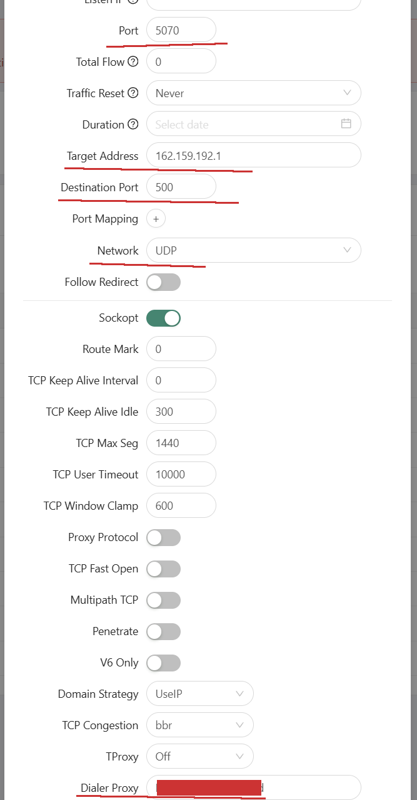
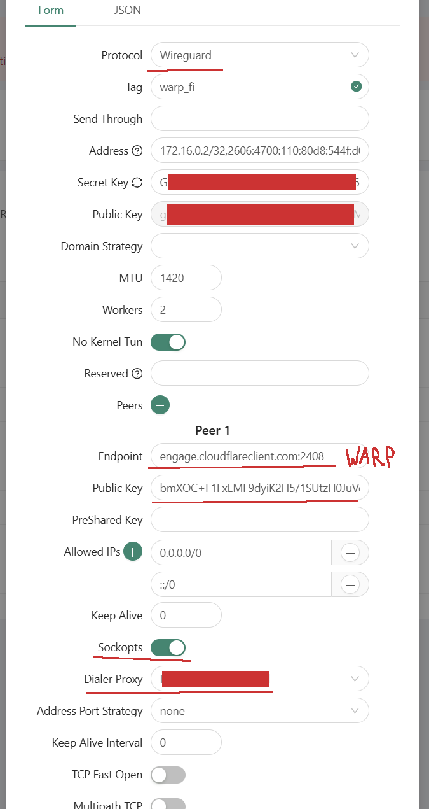

[⬅️ Назад](./)

# Cloudflare WARP через XRay VPN (WARP-over-VLESS) для VRChat
Ниже я опишу как сделать проброс Cloudflare WARP через любой VPN на основе XRay.
Не буду расписывать подробно, т.к. метод довольно экзотический и **требует знаний по xray**. В общих чертах:
Можно сделать WireGuard с конифгом WARP работающим локально, но пускать трафик через XRay.
Для этого можно использовать цепочку из двух XRay: один работает "дома", а другой на VPS.
- "Домашний" XRay играет роль роутера: сам он является клиентом по отношению к XRay на VPS и подключается к нему, но в то же время он сам является сервером для конечных клиентов.
- Серверный XRay на VPS за рубежом просто обеспечивает выход в свободный интернет и защиту трафика от DPI ТСПУ.

Т.е. получается цепочка: клиент <--> "Домашний" XRay <--> XRay на VPS <--> Интернет.

**И далее получается 2 способа:**

## Проброс порта для AmneziaWG через XRay:
На "Домашнем" XRay создаётся Inbound типа tunnel (dokodemo door) от какого-то порта (например, Port 5070) к какому-нибудь из IP и порту Cloudflare WARP (например, Network UDP, Target Address 162.159.192.1, Destination Port 500), а в кчачестве Dialer Proxy указывается ваш Outbound на XRay на VPS.

Теперь вы можете подключаться к "Домашнему" XRay на указанный порт через AmneziaWG или WireGuard вместо IP WARP.

См. пример ниже.

Т.е. я как будто бы подключаюсь к компу в локальной сети по обычному WireGuard, а не к Cloudflare WARP, но XRay роутит трафик на Cloudflare WARP сам.

Это работает не только для локальной сети - можно открыть порт во вне и подключаться откуда угодно в пределах РФ.

## WireGuard Outbound на WARP в "Домашнем" XRay:
На "Домашнем" XRay создаётся Outbound типа WireGuard, с вручную забитыми настройки Cloudflare WARP, при этом включается Sockopts и в качетсве Dialer Proxy указывается ваш Outbound на XRay на VPS.

Теперь этот Outbound будет работать как Cloudflare WARP.
Далее создаются свои Inbound'ы и Routing правила под себя. 
На практике этот метод лично у меня оказался нестабильным.
Я не знаю почему, но Outbound иногда просто рандомно перестаёт работать до перезапуска XRay. 🤷🏻

